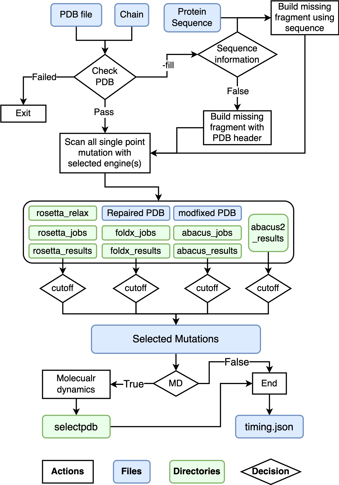
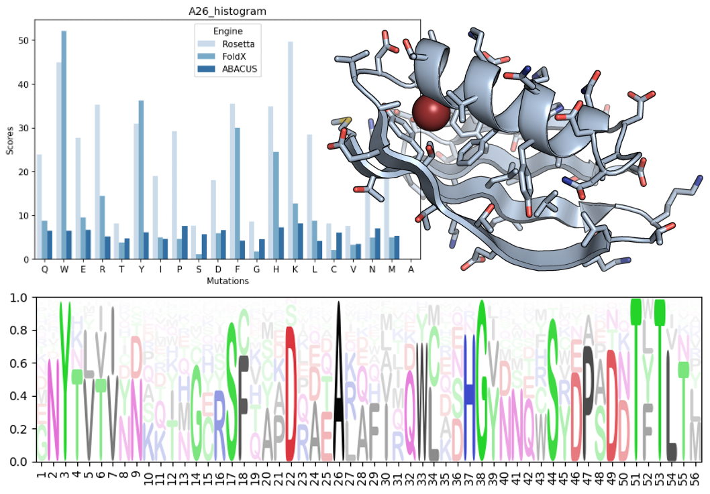

# Towards Stable Proteins
Table of Contents
=================

* [Towards Stable Proteins](#towards-stable-proteins)
  * [The GUI plugin for FoldX.](#the-gui-plugin-for-foldx)
  * [Installation](#installation)
  * [Usage](#usage)
     * [Grape phase I](#grape-phase-i)
     * [List distribute](#list-distribute)
     * [Analysis and plot](#analysis-and-plot)
  * [QuickStart](#quickstart)
     * [Grape phase I](#grape-phase-i-1)
       * [Inspect structures](#inspect-structures)
     * [List distribute](#list-distribute-1)
     * [Analysis <em>in silico</em> screening results](#analysis-in-silico-screening-results)
  * [Develop Information](#develop-information)
  * [Known Issues](#known-issues)
  * [Citation](#citation)
  * [Lisense](#lisense)
  * [Need help?](#need-help?)
  
**I am testing this repo with some different input structures, if you encountered any failure please post a issue.** 

## The GUI plugin for FoldX.
[GUI](GUI/) only work for FoldX.

## Installation
 
First of all, please make sure you have added the **FoldX** executable to your environment! Secondly, **Rosetta** 
(a mpi build is necessary) is 
required for cartesian_ddg (`-mode slow`) calculation or pmut_scan(`-mode fast`). 
Also, **ABACUS** is an outstanding software with great statistical energy function for protein design. 
Structures downloaded from RCSB could be erroneous. One of the biggest problems that will directly affect energy calculation is breaks in chains. 
Here I implemented a loop closure module using **modeller**, a great software with a very long history, as backend.   
Due to their licenses, I cannot redistribute them here :worried: !  
To our glad, **openmm** is open source! So the glass is half full :smiley: . 
Here is a good news, the **ABACUS2** database is now available at https://zenodo.org/record/4533424. However, the necessary 
module is not available in the zenodo version, you may use the online server at https://biocomp.ustc.edu.cn/servers/abacus-design.php to run ABACUS2.
  
**Conda**:
```shell
# clone repo and create a new conda env
git clone https://github.com/JinyuanSun/DDGScan.git
cd DDGScan
conda env create -f environment.yml
# activate new env
conda activate ddgscan
# install
./setup.py install
```
**Via Pip**
```shell
git clone https://github.com/openmm/pdbfixer.git && cd pdbfixer && python setup.py install && cd ..
git clone https://github.com/JinyuanSun/DDGScan.git && cd DDGScan  && pip install -r requirements.txt && ./setup.py install
```


I will recommend that users export `ROSETTADB` before runing `grape-fast.py` by appending this into `~/.bashrc`:
```
export ROSETTADB="/path/to/rosetta/database"
```
## Usage
### Grape phase I
I provide many options for users especially those know what they want. I really tried to make this package light and also 
be well functional. Here are some quick walk-through. `pdb` and `chain` are positional but really you need to set 
`-E` according to the software you have in your OS. `-seq` are strongly recommended to be set by the user. 
Also, I highly recommend adding the `-MD` flag and using `-P CUDA` if a good gpu is available (better
 than RTX2060 well be much faster than 48 core cpu). Also, I did not test how much precision dropped to use the `-S fast` 
 preset, but I do know it can be faster in about two orders of magnitude.  
 If using `-fill` flag, input structure will be automatically fixed using information from SEQRES record in native PDB 
 downloaded from RCSB using modeller. Model with lowest `molpdf` energy will be subjected to following step.  
 
 <p align="center">
  
</p>

```
usage: DDGScan grape_phaseI [-h] [-fill] [-seq SEQUENCE] [-T THREADS] [-fc FOLDX_CUTOFF] [-rc ROSETTA_CUTOFF] [-ac ABACUS_CUTOFF] [-a2c ABACUS2_CUTOFF] [-nstruct RELAX_NUMBER]
                            [-nruns NUMOFRUNS] [-E {abacus,foldx,rosetta,abacus2} [{abacus,foldx,rosetta,abacus2} ...]] [-M {run,rerun,analysis,test}] [-S {fast,slow}] [-MD] [-P {CUDA,CPU}]
                            [-fix_mm]
                            pdb chain

positional arguments:
  pdb                   Input PDB
  chain                 Input PDB Chain to do in silico DMS

optional arguments:
  -h, --help            show this help message and exit
  -fill, --fill_break_in_pdb
                        Use modeller to fill missing residues in your pdb file. Use this option with caution!
  -seq SEQUENCE, --sequence SEQUENCE
                        The exact sequence of protein you want to design. All mutation will be named according to this sequence.
  -T THREADS, --threads THREADS
                        Number of threads to run FoldX, Rosetta
  -fc FOLDX_CUTOFF, --foldx_cutoff FOLDX_CUTOFF
                        Cutoff of FoldX ddg(kcal/mol)
  -rc ROSETTA_CUTOFF, --rosetta_cutoff ROSETTA_CUTOFF
                        Cutoff of Rosetta ddg(R.E.U.)
  -ac ABACUS_CUTOFF, --abacus_cutoff ABACUS_CUTOFF
                        Cutoff of ABACUS SEF(A.E.U.)
  -a2c ABACUS2_CUTOFF, --abacus2_cutoff ABACUS2_CUTOFF
                        Cutoff of ABACUS2 SEF(A.E.U.)
  -nstruct RELAX_NUMBER, --relax_number RELAX_NUMBER
                        Number of how many relaxed structure
  -nruns NUMOFRUNS, --numofruns NUMOFRUNS
                        Number of runs in FoldX BuildModel
  -E {abacus,foldx,rosetta,abacus2} [{abacus,foldx,rosetta,abacus2} ...], --engine {abacus,foldx,rosetta,abacus2} [{abacus,foldx,rosetta,abacus2} ...]
  -M {run,rerun,analysis,test}, --mode {run,rerun,analysis,test}
                        Run, Rerun or analysis
  -S {fast,slow}, --preset {fast,slow}
                        Fast or Slow
  -MD, --molecular_dynamics
                        Run 1ns molecular dynamics simulations for each mutation using openmm.
  -P {CUDA,CPU}, --platform {CUDA,CPU}
                        CUDA or CPU
  -fix_mm, --fix_mainchain_missing
                        fixing missing backbone bone using pdbfixer

```

### List distribute
```
usage: DDGScan list_distribute [-h] [-msaddg] [-fill] [-fix_mm] [-T THREADS] [-nstruct RELAX_NUMBER] [-nruns NUMOFRUNS] [-E {foldx,rosetta,abacus2} [{foldx,rosetta,abacus2} ...]] [-repair]
                               [-MD] [-P {CUDA,CPU}]
                               pdb mutation_list_file

positional arguments:
  pdb                   Input PDB
  mutation_list_file    Mutation list file, see README for details

optional arguments:
  -h, --help            show this help message and exit
  -msaddg, --output_of_MSAddg
                        The format of MSAddg *.scan.txt, and there may be mismatch between your pdb and sequence
  -fill, --fill_break_in_pdb
                        Use modeller to fill missing residues in your pdb file. Use this option with caution!
  -fix_mm, --fix_mainchain_missing
                        fixing missing backbone bone using pdbfixer
  -T THREADS, --threads THREADS
                        Number of threads to run FoldX, Rosetta or ABACUS2
  -nstruct RELAX_NUMBER, --relax_number RELAX_NUMBER
                        Number of how many relaxed structure
  -nruns NUMOFRUNS, --numofruns NUMOFRUNS
                        Number of runs in FoldX BuildModel
  -E {foldx,rosetta,abacus2} [{foldx,rosetta,abacus2} ...], --engine {foldx,rosetta,abacus2} [{foldx,rosetta,abacus2} ...]
  -repair, --foldx_repair
                        Run Repair before ddG calculation
  -MD, --molecular_dynamics
                        Run 1ns molecular dynamics simulations for each mutation using openmm.
  -P {CUDA,CPU}, --platform {CUDA,CPU}
                        CUDA or CPU
```

### Analysis and plot
```
usage: DDGScan analysis_and_plot [-h] [--residue_position RESIDUE_POSITION]
                                 [--plot_type {all,venn,residue_bar,heatmap,position_avg_boxplot,variance_lineplot,kde_plot,residue_logo} [{all,venn,residue_bar,heatmap,position_avg_boxplot,variance_lineplot,kde_plot,residue_logo} ...]]
                                 pdb results_dir

positional arguments:
  pdb                   your target pdb file
  results_dir           directory of results of grape_phase_I or list_distribute

optional arguments:
  -h, --help            show this help message and exit
  --residue_position RESIDUE_POSITION
                        residue position, if you asked for a barplot at residue level
  --plot_type {all,venn,residue_bar,heatmap,position_avg_boxplot,variance_lineplot,kde_plot,residue_logo} [{all,venn,residue_bar,heatmap,position_avg_boxplot,variance_lineplot,kde_plot,residue_logo} ...]
                        plots you want to make

```

## QuickStart
### Grape phase I
You may want to try it out on a small protein like [Gb1](https://www.rcsb.org/structure/1PGA):  
I will recommend using the `-S fast` with `-MD` flag, and using `CUDA` to accelerate molecular dynamics simulations. 
This is a very good crystal structure solved by X-ray, so I did not pass any value about fixing the PDB file!  
Using `-S slow` to get more accuracy!
```bash
wget https://files.rcsb.org/download/1PGA.pdb
DDGScan grape_phaseI 1PGA.pdb A -E foldx abaucs rosetta -M run -T 40 -S slow -MD -P CUDA
```
You should expecting outputs like:  
A folder named `foldx_results` containing:
```
All_FoldX.score
MutationsEnergies_BestPerPositionBelowCutOff_SortedByEnergy.tab
MutationsEnergies_BelowCutOff.tab
MutationsEnergies_BestPerPosition_SortedByEnergy.tab
MutationsEnergies_BelowCutOff_SortedByEnergy.tab
MutationsEnergies_CompleteList.tab
MutationsEnergies_BestPerPosition.tab
MutationsEnergies_CompleteList_SortedByEnergy.tab
MutationsEnergies_BestPerPositionBelowCutOff.tab
```
And another folder named `foldx_jobs` contains many subdirectories, in each subdirectory, containing raw output for 
every mutation built by FoldX. Of course, there will be directories start with rosetta or abacus, depending on your choice!  
If `-md` was turned on, all produced snapshots can be found in `selectpdb` with `afterMD` as a suffix in the name of PDB files.
#### Inspect structures
Using `scripts/inspectmutation.py` to inspect mutations in pymol:
```bash
pymol inspectmutation.py $Wildtype_structure $Mutation_structure $Mutation_position $Chain
```
About principles for protein physics, refer to  [this book](https://u1lib.org/book/2801005/141419).
### List distribute
For a given set of single-point mutations of a protein. This module distributes calculations to cores and can parse 
pre-defined special groups of mutations to make.
```
# followings are pre-defined groups:
    _small: GAVSTC
    _large: FYWKRHQE
    _neg: DE
    _pos: RK
    _polar: YTSHKREDQN
    _non_charged_polar: YTSNQH
    _hydrophobic: FILVAGMW
    _cys: C
    _pro: P
    _scan: ARNDCQEGHILKMFPSTWYV
```
Also, "dynamic selection" are supported. 
```
# followings are dynamic selection:
    @smaller: mutation to AA with smaller vdw
    @bigger: mutation to AA with bigger vdw
    @more_hydrophobic: mutation to AA more hydrophobic
    @less_hydrophobic: mutation to AA more hydrophilic
    @more_sheet_tendency: mutation to AA with higher sheet tendency
    @less_sheet_tendency: mutation to AA with lower sheet tendency
    @more_helix_tendency: mutation to AA with higher helix tendency
    @less_helix_tendency: mutation to AA with lower helix tendency
    @{random}: random is an integer in range 1 to 19 ,randomly select few mutations for you, good luck!
```
An example mutation list file is a plain text file seperated with space,
looks like:
```           
wildtype chain position mutation
A A 26 P
A A 26 ILV # make A -> I,L,V
A A 26 _polar # make A -> Y,T,S,H,K,R,E,D,Q,N
A A 26 @9
A A 26 @smaller # make A -> G
```
DDGScan also support MSAddg output, you need to add a `-msaddg` flag. The best 80 predictions made by MSAddg will be 
selected.
```bash
DDGScan list_distribute 1pga.pdb 1pga.fa.scan.txt -repair -msaddg -T 10 -E foldx
```
### Analysis *in silico* screening results

Post analysis can help you to easily access to many kinds of plots. 
Here are two example of a bar-plot of a saturated single point mutation and mutation logo sequence.
 <p align="center">
  
</p>

## Develop Information
2019.04: Developed GUI and single mutation scan for FoldX.  
2021.10: Restart this project for Rosetta and ABACUS supporting.  
2021.11: Added `openmm` for MDs.  
2021.12: Added `modeller` for loop modelling and args was rewritten.  
2022.03: Released a few more codes on plotting and updateed the command line interface.  
**2022.04: Release v0.1.0!**  
Continuing...

## Known Issues
To avoid issues caused by pdb file, it is recommended to carefully exam your input file. One can 
use `/path/to/rosetta/main/tools/protein_tools/scripts/clean_pdb.py`
to clean pdb. However, this script will also renumber pdb file.
During test, some cases failed because of the following problems:
- Non-canonical amino acid in pdb will cause failure due to lack parameters in all predictors, therefore is not accepted.   
- Gaps in pdb introduce ugly energy, you may want to apply `-fill` or use model predicted by AlphaFold.

## Citation
For this software:
```bibtex
@software{sun_jinyuan_2022_1046990,
  author       = {Sun Jinyuan},
  title        = {{DDGScan: an integrated parallel workflow for the 
                   in silico point mutation scan of protein}},
  month        = apr,
  year         = 2022,
  publisher    = {Zenodo},
  version      = {v0.1.0},
  doi          = {10.5072/zenodo.1046990},
  url          = {https://doi.org/10.5072/zenodo.1046990}
}
```
For methodology:
```bibtex
@article{cui2021computational,
  title={Computational redesign of a PETase for plastic biodegradation under ambient condition by the GRAPE strategy},
  author={Cui, Yinglu and Chen, Yanchun and Liu, Xinyue and Dong, Saijun and Tian, Yu’e and Qiao, Yuxin and Mitra, Ruchira and Han, Jing and Li, Chunli and Han, Xu and others},
  journal={ACS Catalysis},
  volume={11},
  number={3},
  pages={1340--1350},
  year={2021},
  publisher={ACS Publications}
}
@incollection{sun2021grape,
  title={GRAPE, a greedy accumulated strategy for computational protein engineering},
  author={Sun, Jinyuan and Cui, Yinglu and Wu, Bian},
  booktitle={Methods in Enzymology},
  volume={648},
  pages={207--230},
  year={2021},
  publisher={Elsevier}
}
```
## Lisense
```
MIT License

Copyright (c) 2022 jinyuan sun

Permission is hereby granted, free of charge, to any person obtaining a copy
of this software and associated documentation files (the "Software"), to deal
in the Software without restriction, including without limitation the rights
to use, copy, modify, merge, publish, distribute, sublicense, and/or sell
copies of the Software, and to permit persons to whom the Software is
furnished to do so, subject to the following conditions:

The above copyright notice and this permission notice shall be included in all
copies or substantial portions of the Software.

THE SOFTWARE IS PROVIDED "AS IS", WITHOUT WARRANTY OF ANY KIND, EXPRESS OR
IMPLIED, INCLUDING BUT NOT LIMITED TO THE WARRANTIES OF MERCHANTABILITY,
FITNESS FOR A PARTICULAR PURPOSE AND NONINFRINGEMENT. IN NO EVENT SHALL THE
AUTHORS OR COPYRIGHT HOLDERS BE LIABLE FOR ANY CLAIM, DAMAGES OR OTHER
LIABILITY, WHETHER IN AN ACTION OF CONTRACT, TORT OR OTHERWISE, ARISING FROM,
OUT OF OR IN CONNECTION WITH THE SOFTWARE OR THE USE OR OTHER DEALINGS IN THE
SOFTWARE.
```
## Need help?
If you need any help like installing backend software or interpreting results, you may contact me to get help by 
filling [this form](https://forms.gle/1V6hjAtf3MFTGvPQ7). 
