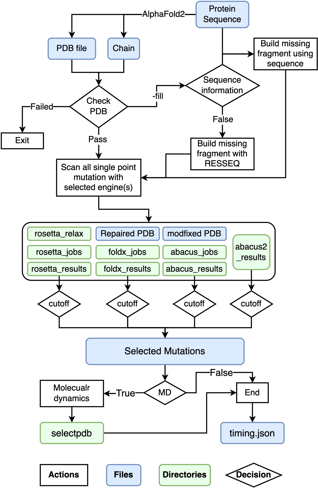

# Towards Stable Proteins

- [Towards Stable Proteins](#towards-stable-proteins)
    + [The GUI plugin for FoldX.](#the-gui-plugin-for-foldx)
    + [Installation](#installation)
    + [Usage](#usage)
    + [QuickStart](#quickstart)
    + [Inspect structures](#inspect-structures)
    + [Citations](#citations)
    + [Others](#others)
    + [Develop Information](#develop-information)
    + [Known Issues](#known-issues)

**I am testing this repo with some different input structures, if you encountered any failure please post a issue.** 

### The GUI plugin for FoldX.
[GUI](GUI/) only work for FoldX.

### Installation
 
First of all, please make sure you have added the **FoldX** executable to your environment! Secondly, **Rosetta** 
(a mpi build is necessary) is 
required for cartesian_ddg (`-mode slow`) calculation or pmut_scan(`-mode fast`). 
Also, **ABACUS** is an outstanding software with great statistical energy function for protein design. 
Structures downloaded from RCSB could be erroneous. One of the biggest problems that will directly affect energy calculation is breaks in chains. 
Here I implemented a loop closure module using **modeller**, a great software with a very long history, as backend.   
Due to their licenses, I cannot redistribute them here :worried: !  
To our glad, **openmm** is open source! So the glass is half full :smiley: . Here is a good news, the **ABACUS2** is now available at https://zenodo.org/record/4533424.
  
**Conda**:
```bash
# create a new conda env
conda create -n grape -c conda-forge python=3.8 openmm pdbfixer
# activate new env
conda activate grape
# clone repo and install
git clone https://github.com/JinyuanSun/DDGScan.git && cd DDGScan && ./setup.py install
```
I will recommend that users export `ROSETTADB` before runing `grape-fast.py` by appending this into `~/.bashrc`:
```
export ROSETTADB="/path/to/rosetta/database"
```
### Usage
I provide many options for users especially those know what they want. I really tried to make this package light and also 
be well functional. Here are some quick walk-through. `pdb` and `chain` are positional but really you need to set 
`-E` according to the software you have in your OS. `-seq` are strongly recommended to be set by the user. 
Also, I highly recommend adding the `-MD` flag and using `-P CUDA` if a good gpu is available (better
 than RTX2060 well be much faster than 48 core cpu). Also, I did not test how much precision dropped to use the `-S fast` 
 preset, but I do know it can be faster in about two orders of magnitude.  
 If using `-fill` flag, input structure will be automatically fixed using information from SEQRES record in native PDB 
 downloaded from RCSB using modeller. Model with lowest `molpdf` energy will be subjected to following step.  
 
 <p align="center">
  
</p>

```
Run FoldX, Rosetta and ABACUS for in silico deep mutation scan.

positional arguments:
  pdb                   Input PDB
  chain                 Input PDB Chain to do in silico DMS

optional arguments:
  -h, --help            show this help message and exit
  -fill, --fill_break_in_pdb
                        Use modeller to fill missing residues in your pdb file. Use this option with caution!
  -seq SEQUENCE, --sequence SEQUENCE
                        The exact sequence of protein you want to design. All mutation will be named according to this sequence.
  -T THREADS, --threads THREADS
                        Number of threads to run FoldX, Rosetta
  -fc FOLDX_CUTOFF, --foldx_cutoff FOLDX_CUTOFF
                        Cutoff of FoldX ddg(kcal/mol)
  -rc ROSETTA_CUTOFF, --rosetta_cutoff ROSETTA_CUTOFF
                        Cutoff of Rosetta ddg(R.E.U.)
  -ac ABACUS_CUTOFF, --abacus_cutoff ABACUS_CUTOFF
                        Cutoff of ABACUS SEF(A.E.U.)
  -a2c ABACUS2_CUTOFF, --abacus2_cutoff ABACUS_CUTOFF
                        Cutoff of ABACUS2 SEF(A.E.U.)
  -nstruct RELAX_NUMBER, --relax_number RELAX_NUMBER
                        Number of how many relaxed structure
  -nruns NUMOFRUNS, --numofruns NUMOFRUNS
                        Number of runs in FoldX BuildModel
  -E {abacus,foldx,rosetta} [{abacus,foldx,rosetta,abacus2} ...], --engine {abacus,foldx,rosetta,abacus2} [{abacus,foldx,rosetta,abacus2} ...]
  -M {run,rerun,analysis,test}, --mode {run,rerun,analysis,test}
                        Run, Rerun or analysis
  -S {fast,slow}, --preset {fast,slow}
                        Fast or Slow
  -MD, --molecular_dynamics
                        Run 1ns molecular dynamics simulations for each mutation using openmm.
  -P {CUDA,CPU}, --platform {CUDA,CPU}
                        CUDA or CPU
```


### QuickStart
You may want to try it out on a small protein like [Gb1](https://www.rcsb.org/structure/1PGA):  
I will recommend using the `-S fast` with `-MD` flag, and using `CUDA` to accelerate molecular dynamics simulations. 
This is a very good crystal structure solved by X-ray, so I did not pass any value about fixing the PDB file!  
Using `-S slow` to get more accuracy!
```bash
wget https://files.rcsb.org/download/1PGA.pdb
grape-fast.py 1PGA.pdb A -E foldx abaucs rosetta -M run -T 40 -S slow -MD -P CUDA
```
You should expecting outputs like:  
A folder named `foldx_results` containing:
```
All_FoldX.score
MutationsEnergies_BestPerPositionBelowCutOff_SortedByEnergy.tab
MutationsEnergies_BelowCutOff.tab
MutationsEnergies_BestPerPosition_SortedByEnergy.tab
MutationsEnergies_BelowCutOff_SortedByEnergy.tab
MutationsEnergies_CompleteList.tab
MutationsEnergies_BestPerPosition.tab
MutationsEnergies_CompleteList_SortedByEnergy.tab
MutationsEnergies_BestPerPositionBelowCutOff.tab
```
And another folder named `foldx_jobs` contains many subdirectories, in each subdirectory, containing raw output for 
every mutation built by FoldX. Of course, there will be directories start with rosetta or abacus, depending on your choice!  
If `-md` was turned on, all produced snapshots can be found in `selectpdb` with `afterMD` as a suffix in the name of PDB files.
### Inspect structures
Using `scripts/inspectmutation.py` to inspect mutations in pymol:
```bash
pymol inspectmutation.py $Wildtype_structure $Mutation_structure $Mutation_position $Chain
```
About principles for protein physics, refer to  [this book](https://u1lib.org/book/2801005/141419).
### Citations
If you find the models useful in your research, we ask that you cite the relevant paper:

```bibtex
@article{cui2021computational,
  title={Computational redesign of a PETase for plastic biodegradation under ambient condition by the GRAPE strategy},
  author={Cui, Yinglu and Chen, Yanchun and Liu, Xinyue and Dong, Saijun and Tian, Yu’e and Qiao, Yuxin and Mitra, Ruchira and Han, Jing and Li, Chunli and Han, Xu and others},
  journal={ACS Catalysis},
  volume={11},
  number={3},
  pages={1340--1350},
  year={2021},
  publisher={ACS Publications}
}
@incollection{sun2021grape,
  title={GRAPE, a greedy accumulated strategy for computational protein engineering},
  author={Sun, Jinyuan and Cui, Yinglu and Wu, Bian},
  booktitle={Methods in Enzymology},
  volume={648},
  pages={207--230},
  year={2021},
  publisher={Elsevier}
}
```

### Develop Information
2019.04: Developed GUI and single mutation scan for FoldX.  
2021.10: Restart this project to implement GRAPE.  
2021.11: Added `openmm` for MDs.  
2021.12: Added `modeller` for loop modelling and args was rewritten.  
2022.03: Fixed few bugs and working on possible docker image.  
Developed this in every day 20:00 - 02:00 :cat: . Continuing...   
Feel free to contact with me if you have any further questions on computational enzyme designfeel free to get in touch with me: <jinyuansun98@gmail.com>.

### Known Issues
To avoid issues caused by pdb file, it is recommended to carefully exam your input file. One can 
use `/path/to/rosetta/main/tools/protein_tools/scripts/clean_pdb.py`
to clean pdb. However, this script will also renumber pdb file.
During test, some cases failed because of the following problems:
- MainChain Atoms missing for a residue. FoldX will create a gap.
- Non-canonical amino acid in pdb will cause failure due to lack parameters in all predictors, therefore is not accepted.   
- Gaps in pdb introduce ugly energy, you may want to apply `-fill` or use model predicted by AlphaFold.

### Others
如果你在中国大陆地区，可以使用：
```bash
# 可能会落后此仓库一段时间
git clone https://gitee.com/puzhunanlu30/Codes_for_FoldX.git
```
or try this:
```bash
git clone https://github.com.cnpmjs.org/JinyuanSun/DDGScan.git
```

